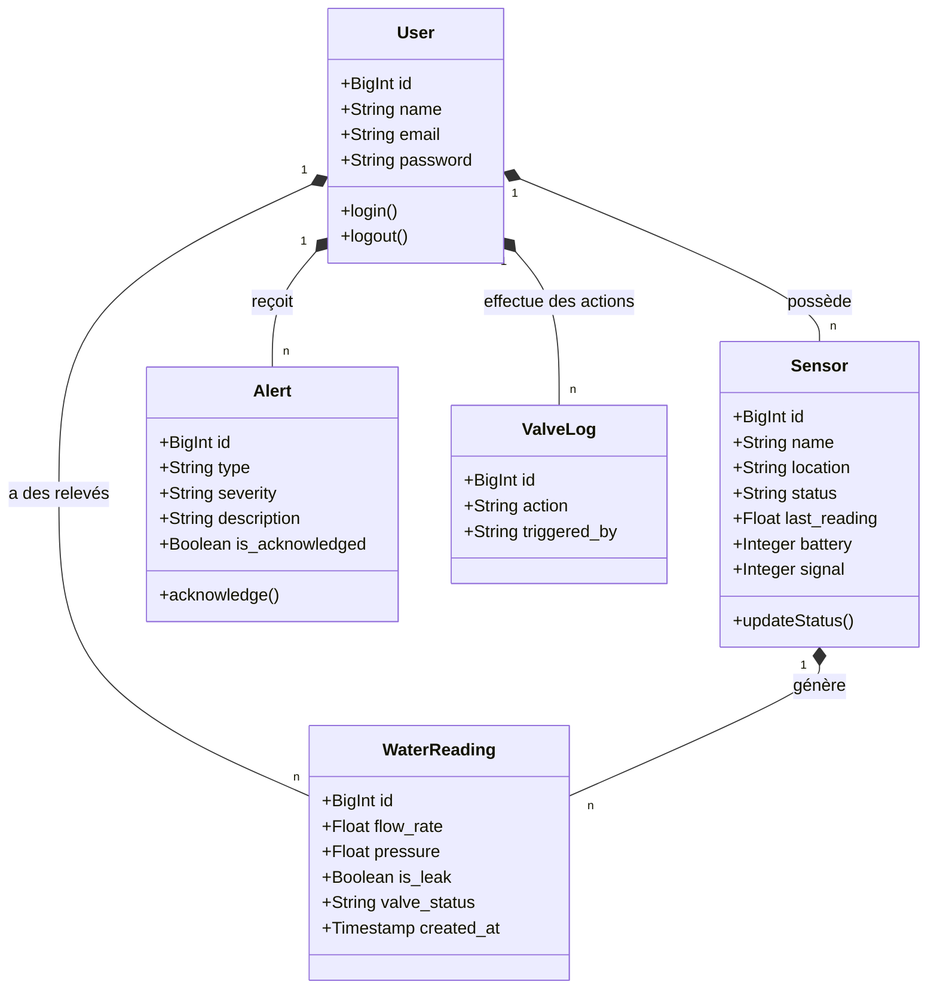
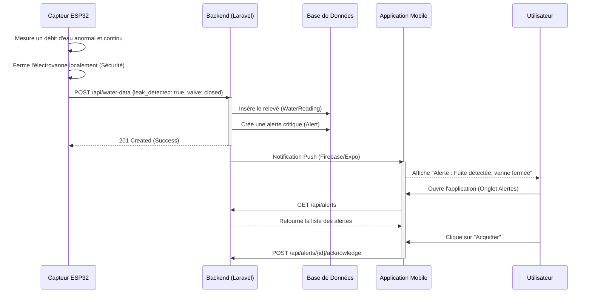
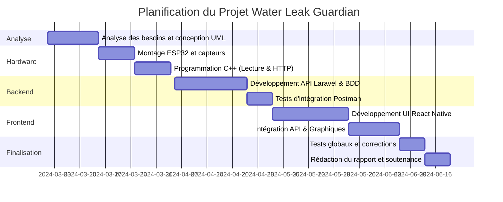

# Rapport de projet de synthèse : Water Leak Guardian
**Établissement :** Office de la Formation Professionnelle et de la Promotion du Travail (OFPPT) - ISTA Al Adarissa de Fès
**Filière :** Développement Digital Full Stack
**Formatrice :** Asmae YOUALA
**Année scolaire :** 2023 - 2024
**Réalisé par :** Anass Es-Salmany & El Mostafa Belayd

---

## Introduction

Le projet **"Water Leak Guardian"** est un système intelligent (IoT) combiné à une application mobile visant à détecter et gérer les fuites d'eau en temps réel, répondant ainsi au problème critique de la perte d'eau potable au Maroc (près de 35% de pertes dans les canalisations). L'objectif principal de cette solution est de permettre aux ménages de surveiller leur consommation, d'être alertés instantanément en cas d'anomalie, et de couper automatiquement l'arrivée d'eau pour éviter les dégâts matériels et le gaspillage. Ce rapport détaille, dans son premier chapitre, la présentation et les enjeux du projet, suivi au deuxième chapitre par l'analyse et la conception du système (diagrammes UML), et se termine par un troisième chapitre consacré à la réalisation technique, la planification et une étude de cas illustrée.

---

## Chapitre I : Présentation du projet 

### 1. Description du projet
**Water Leak Guardian** est une solution complète combinant le matériel (IoT) et le logiciel. Elle se compose d'un microcontrôleur ESP32 relié à un capteur de débit d'eau et une électrovanne installés sur la tuyauterie principale. L'ESP32 communique en continu avec une API backend (Laravel). L'utilisateur final interagit avec le système via une application mobile (React Native) qui lui affiche son tableau de bord, l'historique de sa consommation, et lui permet de contrôler sa vanne à distance.

### 2. Objectifs
- **Surveiller :** Mesurer en temps réel le débit et la consommation journalière de l'eau.
- **Détecter :** Identifier toute anomalie ou fuite (goutte à goutte continu ou rupture de canalisation).
- **Alerter :** Envoyer des notifications (push/email) immédiates à l'utilisateur.
- **Agir :** Fermer automatiquement l'électrovanne dès qu'une fuite est avérée, sans intervention humaine.

### 3. Analyse des besoins du client ou de l'utilisateur final
L'utilisateur a besoin de :
- Consulter l'état de son réseau d'eau en temps réel depuis son smartphone.
- Être notifié même lorsque l'application est fermée en cas d'urgence.
- Pouvoir fermer ou ouvrir l'arrivée d'eau manuellement d'un simple clic (lors d'un départ en vacances par exemple).
- Avoir un historique visuel (statistiques hebdomadaires et mensuelles) pour comprendre ses habitudes de consommation.
- Un système fiable qui peut agir de manière autonome s'il ne peut pas réagir à temps.

### 4. Identification des risques et des opportunités
- **Risques :**
  - Coupure de courant (le système nécessite une alimentation électrique).
  - Coupure de la connexion Wi-Fi (l'ESP32 ne pourra plus envoyer les données en temps réel au serveur, bien que la fermeture locale reste possible).
  - Défaillance mécanique de l'électrovanne due au calcaire.
- **Opportunités :**
  - Réduction drastique des factures d'eau pour les ménages.
  - Sauvegarde des ressources hydriques nationales (intégration potentielle au concept de *Smart City*).
  - Possibilité d'évolution du projet en utilisant l'Intelligence Artificielle pour prédire les fuites futures en fonction des habitudes.

---

## Chapitre II : Analyse et conception du projet

### 1. Diagramme de cas d'utilisation

```mermaid
usecaseDiagram
    actor Utilisateur as "Utilisateur"
    actor SystemeIoT as "Système IoT (ESP32)"

    package "Water Leak Guardian App" {
        usecase UC1 as "S'authentifier"
        usecase UC2 as "Consulter le tableau de bord"
        usecase UC3 as "Contrôler la vanne à distance"
        usecase UC4 as "Consulter l'historique et les statistiques"
        usecase UC5 as "Recevoir et gérer les alertes"
        
        usecase UC6 as "Transmettre les relevés de débit"
        usecase UC7 as "Fermer automatiquement la vanne"
        usecase UC8 as "Générer une alerte critique"
    }

    Utilisateur --> UC1
    Utilisateur --> UC2
    Utilisateur --> UC3
    Utilisateur --> UC4
    Utilisateur --> UC5

    SystemeIoT --> UC6
    SystemeIoT --> UC7
    
    UC6 ..> UC8 : <<include>> (si fuite détectée)
```

### 2. Diagramme de classe 



### 3. Diagramme de séquence (scénario principal)
**Scénario :** Détection de fuite d'eau, fermeture automatique et alerte de l'utilisateur.



---

## Chapitre III : Déroulement et réalisation

### 1. Planification et gestion du projet
La réalisation du projet s'est étalée sur plusieurs phases, structurées de manière agile pour assurer la bonne intégration entre le matériel, le backend et le frontend.



### 2. Choix technique : Description brève des outils utilisés
- **Matériel (IoT) :** ESP32 (Microcontrôleur Wi-Fi), Capteur de débit YF-S201 (Effet Hall), Électrovanne 12V.
- **Backend (API) :** **Laravel 11** (PHP). Choisi pour sa robustesse, son ORM Eloquent performant et sa sécurité native avec Laravel Sanctum.
- **Base de Données :** **MySQL**. Système de gestion de base de données relationnelle idéal pour structurer les utilisateurs, les capteurs et l'historique des relevés.
- **Frontend (Mobile) :** **React Native avec Expo**. Permet de coder une seule fois en TypeScript et de déployer sur Android et iOS.
- **Style :** **NativeWind** (Tailwind CSS pour React Native) qui permet un design moderne, rapide et réactif.
- **Outils de gestion :** Git/GitHub (Versionnement), Postman (Tests API).

### 3. Etude de cas : Présentation du scénario principal
**Scénario : Contrôle et Monitoring de la Consommation d'eau**

1. **Tableau de bord (Dashboard) :** 
   L'utilisateur se connecte et arrive sur l'écran d'accueil. Le système affiche le débit en temps réel récupéré de l'ESP32. Si tout est normal, une pastille "NORMAL" s'affiche en bleu.
   *(Ici, placez une capture d'écran du Dashboard montrant le débit et le bouton de la vanne).*
   `[Capture d'écran 1 : Dashboard Normal]`

2. **Fermeture manuelle de la vanne :**
   L'utilisateur appuie sur le gros bouton "FERMER LA VANNE". Une boîte de dialogue de confirmation apparaît. Une fois validée, l'API met à jour la base de données et l'application affiche la vanne en rouge (Fermée). L'ESP32 exécute la commande physique.
   *(Ici, placez une capture d'écran du bouton de vanne en état rouge/fermé).*
   `[Capture d'écran 2 : Vanne fermée]`

3. **Réception d'une alerte de fuite :**
   Une fuite est simulée sur l'ESP32. L'application mobile reçoit l'événement et l'onglet "Alertes" affiche une carte rouge critique indiquant "LEAK_DETECTED". L'utilisateur peut cliquer sur le bouton "Acquitter" pour signaler qu'il a pris connaissance du problème.
   *(Ici, placez une capture d'écran de la liste des alertes).*
   `[Capture d'écran 3 : Page des Alertes]`

4. **Visualisation des Statistiques :**
   L'utilisateur consulte l'onglet "Statistiques" pour visualiser ses graphiques (BarChart). Il constate l'eau économisée grâce à la fermeture automatique de la vanne et compare sa consommation de "Cette semaine vs semaine dernière".
   *(Ici, placez une capture d'écran des graphiques).*
   `[Capture d'écran 4 : Graphiques et Statistiques]`

---

## Conclusion & Perspective

Le projet **Water Leak Guardian** a permis de développer une solution de bout en bout (Hardware, Backend, Frontend) parfaitement fonctionnelle. Nous avons réussi à faire communiquer un composant matériel (ESP32) avec une base de données cloud (Laravel), le tout restitué de manière ergonomique et en temps réel sur une application mobile (React Native). 

Les tests effectués confirment que le système est capable de détecter, d'alerter et de fermer la vanne automatiquement sans intervention humaine, remplissant ainsi pleinement son objectif de préservation des ressources hydriques.

**Perspectives d'évolution :**
- **Intelligence Artificielle :** Analyser les habitudes de consommation des ménages à l'aide d'algorithmes de *Machine Learning* pour détecter les "micro-fuites" invisibles qui ne déclenchent pas immédiatement le seuil d'alerte critique.
- **Autonomie Énergétique :** Ajouter un petit panneau solaire ou un système de batterie de secours pour garantir le fonctionnement du système même en cas de coupure de courant prolongée.
- **Gamification :** Ajouter un système de récompenses dans l'application pour encourager les familles à réduire leur consommation d'eau hebdomadaire.
